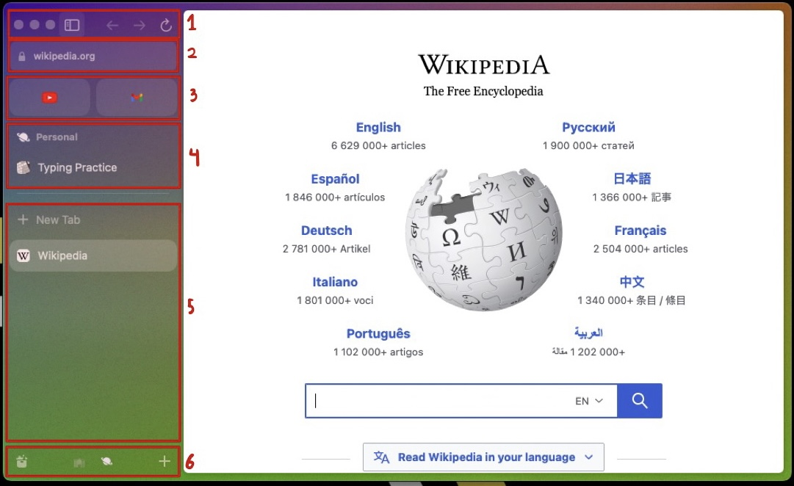

# Manage Tabs using the Arc Browser

 Introduction 

 

Arc is a browser that is designed to make using the internet less overwhelming and organized. For more information go to:

[The Browser Company](https://thebrowser.company/)

 Equipment 

Currently, Arc is only avalible for MacOS. However, versions for Windows, Linux, and Mobile are coming!

 Installation instructions 

[Click here to install](https://arc.net/)

__Note:__ there is a waiting period to download, but if you are student you can get it instantly.

 Where to Get Support 

To get support, click help on the top menu while using arc or go to their [website](https://thebrowser.company/).

 Instructions for Use 

 

 <b> &emsp; </b> Sidebar Basics 

 

1. Top
    * Stoplight
    * Sidebar Lock - locks sidebar so that it is always visible.
    * Go back, go forard, and refresh

1. Search Bar
    * Search
    * Copy Link
    * Capture Image - allows you to snip images 

1. Pinned Tabs

1. Space and Space Tabs

1. Tabs and New Tab

1. Bottom
    * Library - to keep track of media, downloads, easel/notes, spaces, and archived tabs.
    * Space list - allows you to change spaces (you can also two-finger swipe).
    * Add - allows you open new tabs, folders, spaces, easel, note, or boost.

 <b> &emsp; </b> Tab Management 

 

1. Folders 

    * Folders can be used group tabs together
    * To use a folder, create a new one. It will apear in the Space Tabs section. Then, you can start drag tabs in it. You can click on it to open it.
1. Split Screen

    * Split screen is a helpful tool that allows you to view multiple tabs at once.
    * To activate it, just drag a tab from your sidebar into an already open tab. Depending on where you put it, it will show up on the left, right, top, or bottom.
    * In the sidebar, there will be a new tab that has the tabs grouped together.
1. Pinning Tabs

    * You can pin tabs to a spacific space, or to the pinned tabs area to be accessed by all spaces.
    * To pin tab you just have to drag them where you need them
1. Archived Tabs

    * Within the library, there is an archived tabs section. In here you can lookup closed tabs and delete them.

