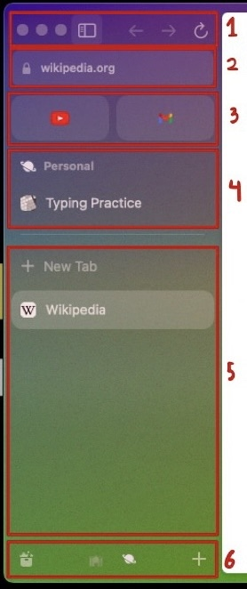
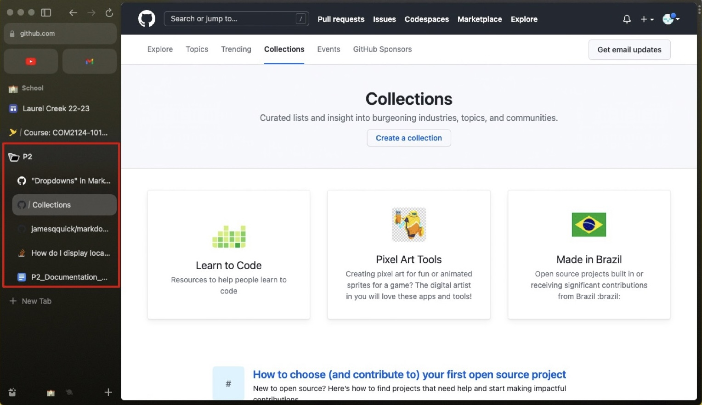
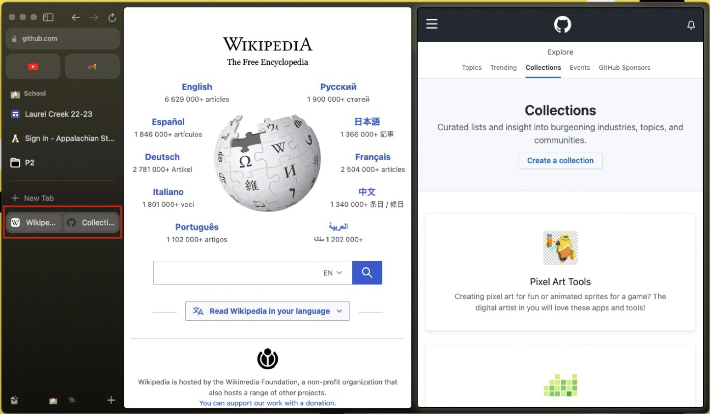
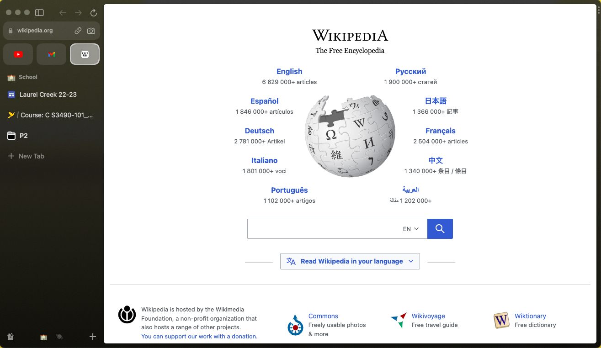
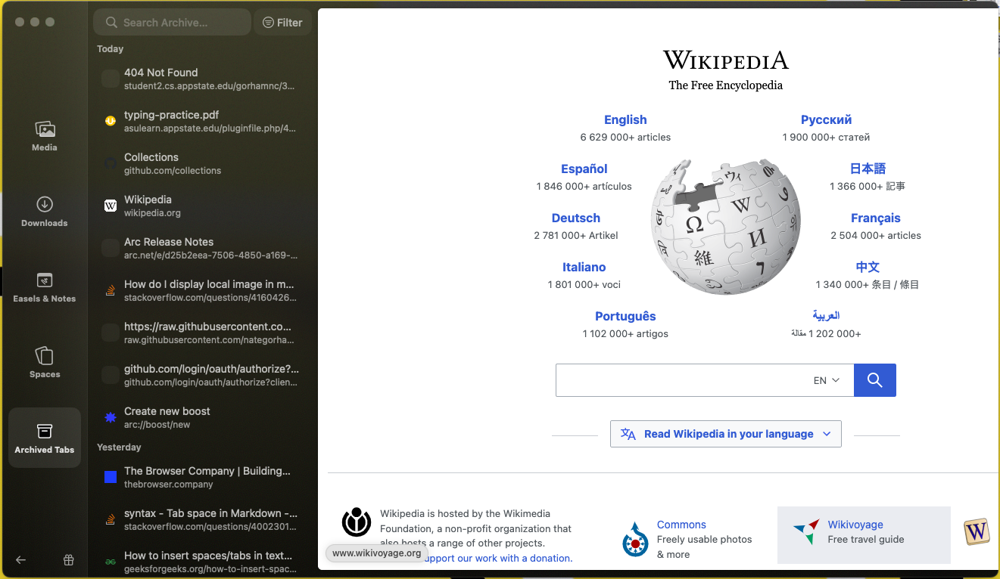

# Manage Tabs using the Arc Browser

<body>
    
</body>

<a href="#Introduction">Introduction</a> 
<a href="#Equipment">Equipment</a> 
<a href="#Installation">Installation</a> 
<a href="#Support">Support</a>

 <a href="#Instructions">Instructions for Use</a> 

 
<ul>
  <li><a href="#SB">Sidebar Basics</a></li>
  <li><a href="#TM">Tab Management</a></li>
</ul>

---

<h2 id="Introduction">Introduction</h2>

Arc is a browser that is designed to make using the internet less overwhelming and organized. For more information go to <a href="https://thebrowser.company/">The Browser Company</a>  website.

<h2 id="Equipment">Equipment</h2>

Currently, Arc is only avalible for MacOS and iOS. However, versions for Windows and Linux are coming!

<h2 id="Installation">Installation</h2>

    <a href="https://arc.net/">Click here to install </a> from The Browser Company website.

__Note:__ there is a waiting period to download, but if you are student you can get it instantly.

<h2 id="Support">Support</h2>

    To get support, click help on the top menu while using arc or go to their <a href="https://thebrowser.company/"> website</a>.

<h2 id="Instructions">Instructions of Use</h2>

This section covers the basics of using the sidebar and how to manage tabs.

<h3 id="SB">Sidebar Basics</h3>

In order to manage tabs while using Arc it is important to understand what the sidebar consists of. The sidebar acts as a homebase of sorts. In the image below is screen shot of the side bar. In this example, it is lable 1-6.    

1. Top
    * Stoplight
    * Sidebar Lock - This keeps the sidebar visible.
    * Go back, go forard, and refresh buttons

1. Search Bar
    * Search
    * Copy Link
    * Capture Image - allows you to snip images 

1. Pinned Tabs

1. Spaces and Space Tabs

1. Tabs and New Tab

1. Bottom
    * Library - to keep track of media, downloads, easel/notes, spaces, and archived tabs.
    * Space list - allows you to change spaces (you can also two-finger swipe).
    * Add - allows you open new tabs, folders, spaces, easel, note, or boost.

   

<h3 id="TM">Tab Management </h3>  

The following is a list of small instructions that can help with managing tabs.

1. Folders 

    * Folders can be used group tabs together
    * To use a folder, create a new one by clicking on the <a href="#SB">add button on the sidebar</a> and selecting "New Folder". It will then apear in the Space Tabs section. After that, you can start drag tabs into it. You can click on it to open and close it.
    

    
 Show Example 

     

    

    

1. Split Screen

    * Split screen is a helpful tool that allows you to view multiple tabs at once.
    * To activate it, just drag a tab from your <a href="#SB">sidebar</a> into an already open tab. Depending on where you put it, it will show up on the left, right, top, or bottom.
    * In the sidebar, there will be a new tab that has the tabs grouped together.
    

    
 Show Example 

     

    

    

1. Pinning Tabs

    * You can pin tabs to a spacific <a href="#SB">space, or to the pinned tabs area</a> to be accessed by all spaces.
    * To pin tab you just have to drag them where you need to put them

    

    
 Show Example 

     

    

    

1. Archived Tabs

    * Within the library, there is an archived tabs section. In here you can lookup closed tabs and delete them.
    * To delet tabs, click on the <a href="#SB">library button on the sidebar</a>. This will open the library menu, from here you can hover your mouse over a tab and click on the trash can icon that will appear.

    

    
 Show Example 

     

    

    

